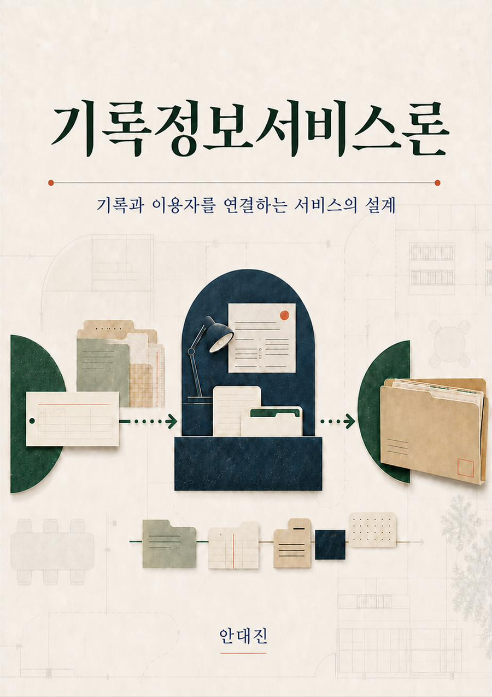

# 기록정보서비스론

**기록과 이용자를 연결하는 서비스의 설계**

서울대학교 인문대학 협동과정 기록학전공 「기록정보서비스론」(2026학년도 2학기) 강의교재의 원본 소스와 빌드 도구입니다.

- 온라인판(전자책): <https://wikidocs.net/book/21081>
- 인쇄본 PDF: [`dist/기록정보서비스론_2026-2_학생용.pdf`](dist/)
- 저자: 안대진 · <djahhn@gmail.com>

<p align="center">
  
</p>

## 교재 구성

15주 강의에 대응하는 15개 장과 서문으로 이루어집니다.

| 부 | 장 | 내용 |
| --- | --- | --- |
| 이론적 기초 | 1~2장 | 기록정보서비스의 개념, 접근의 세 차원, 패러다임 전환 |
| 이용자 연구 | 3~4장 | 이용자 유형과 정보요구, 조사방법론 |
| 접근의 설계 | 5~7장 | 참고봉사, 검색도구, 접근과 프라이버시 |
| 중간 종합 | 8장 | 전반부 개념 지도, 중간시험, 프로젝트 기획 점검 |
| 디지털·데이터 | 9~11장 | 디지털 아카이브 서비스, FAIR 원칙, 시맨틱 검색과 온톨로지 |
| 서비스 프로토타이핑 | 12~13장 | 생성형 AI 활용과 비판적 검토, 구현·검증·문서화 |
| 확장과 평가 | 14~15장 | 아웃리치와 전시, 서비스 평가 |

## 디렉터리

```
src/      원본 마크다운(정본). 00_front.md(서문), 01.md~15.md, 삽화
back/     권말 자료 — 참고문헌, 색인(웹용/색인어 목록), 판권, 저자 소개
build/    빌드·동기화 스크립트
dist/     산출물 PDF
```

`src/*.md`가 정본이며, 여기에서 위키독스 페이지와 Word/PDF 인쇄본이 생성됩니다.

## 빌드

Python 3, [pandoc](https://pandoc.org), LibreOffice가 필요합니다.

```bash
# 인쇄본(Word + PDF) 생성 — 색인 페이지 번호를 얻기 위해 2단계로 빌드됩니다
python3 build/build_book.py student      # 학생용
python3 build/build_book.py instructor   # 교수자용(모범 답안 수록)

# 위키독스 동기화
export WD_TOKEN=...     # 위키독스 API 토큰
python3 build/sync_wikidocs.py
```

빌드 스크립트가 하는 일:

- `build2.py` — 모범 답안 분리(학생용/교수자용), 각주 라벨 정규화
- `design_styles.py` — Word 참조 문서(스타일·색·서체) 생성
- `postprocess.py` — 표지, 표 서식, 구역 설정
- `finalize_uno2.py` — 목차 갱신, 머리글(좌: 쪽수·도서명 / 우: 장 제목·쪽수), 페이지 설정
- `build_book.py` — 위 과정을 묶어 실행하고 색인을 자동 생성
- `wd_style.py` — 위키독스용 스타일 변환(인쇄본과 같은 시각 언어)

## 이용조건

이 저작물은 [크리에이티브 커먼즈 저작자표시-비영리 4.0 국제 라이선스(CC BY-NC 4.0)](https://creativecommons.org/licenses/by-nc/4.0/deed.ko)에 따라 이용할 수 있습니다. 자세한 내용과 인용 형식, 생성형 AI 활용 고지는 [`back/colophon.md`](back/colophon.md)를 참조하세요.

> 안대진. (2026). 『기록정보서비스론: 기록과 이용자를 연결하는 서비스의 설계』[전자책]. 위키독스. https://wikidocs.net/book/21081

본문에 인용된 타인의 저작물은 각 권리자에게 권리가 있으며, 그 이용은 저작권법 제25조·제28조가 허용하는 범위에 따릅니다.

## 참고

- 토론 질문·실습의 모범 답안을 모은 부록 「토론 쟁점 해설」은 수업 진행 중이므로 이 저장소와 공개 PDF에 포함하지 않았습니다. 2026년 12월 학기 종료 후 공개할 예정입니다.
- 11장 실습에 사용하는 학습 사이트: <https://archivelabedu.github.io/ontology-site/>
- 오류 신고와 제안은 Issues 또는 <djahhn@gmail.com>으로 보내 주세요.
